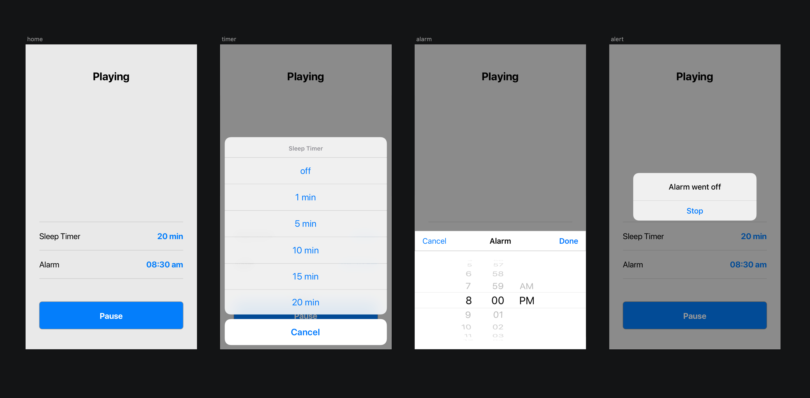

# Boosters: iOS Coding Challenge

Write the application that allows the users to set an alarm, play a sound of nature and record audio when the sound is finished playing. You should provide your solution as a Pull Request to the `master` branch of this repository. Please make commits of logical units, so we can evaluate your progress and add comments as you see fit.

### Further Details

Application should consists of one or two screens. On the main screen the users see state of the application: **idle**, **playing**, **recording**, **paused** or **alarm**; two controls that allow the users to choose duration of **sleep timer** in *minutes* and the **alarm time**; and the **play/pause** button.

The users set desired parameters, tap play button and application starts playing the sound of a nature during **sleep timer** duration in a loop. When the sound is finished, application starts recording audio. In the time of alarm, application will transit to alarm state and start playing alarm sound displaying the alert to the user with one action **Stop**, which will stop the sound and transit application back to **idle** state. If the application is in background when the alarm went off, users should see local notification about the alarm.

Tapping on **play/pause** should start the entire flow or pause playing or recording, but not the alarm.

Everything should work in background as well. If the playing or recording is interrupted by another application using audio session, try to restore application state gracefully.

You should provide a way to switch off playing the sound of nature completely.

### Optional Requirements

- provide a way to switch off recording
- support Dark Mode
- write tests

### Design Example

Here is an example how application might look like, but the final decision is up to you.

### Resources

[Alarm Sound](alarm.m4a), [Nature Sound](nature.m4a)
